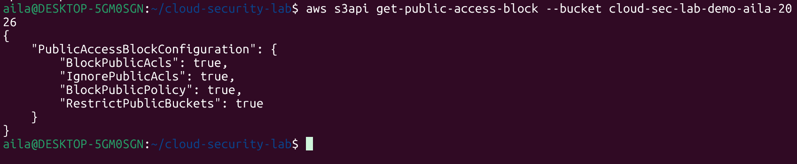
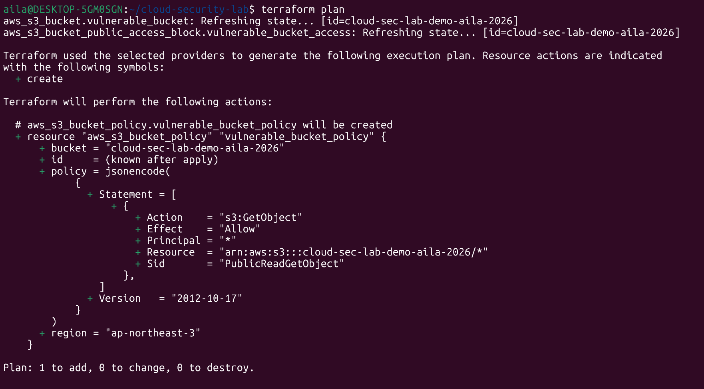
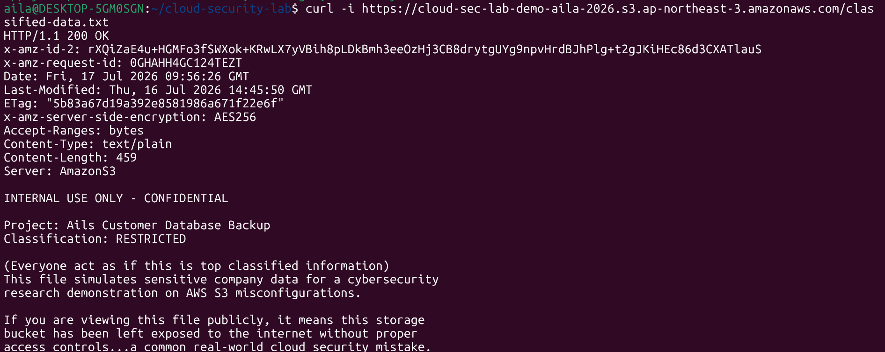
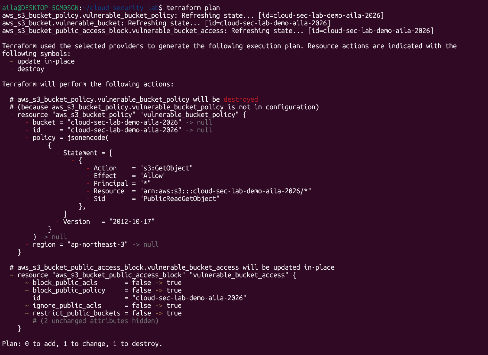
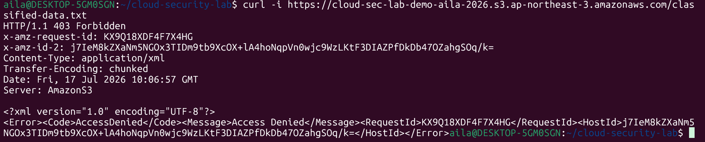

# Cloud Security Lab: S3 Misconfiguration, Detection & Remediation

A hands-on project demonstrating one of the most common real-world cloud security failures, a publicly exposed AWS S3 bucket, built, exploited, detected, and remediated entirely through Infrastructure as Code (Terraform).

This isn't a theoretical writeup. Every step below was actually executed against a real AWS account, with terminal output and CloudTrail logs captured as evidence at each stage.

## Why this matters

Misconfigured S3 buckets are one of the most common causes of real-world data breaches (e.g. Capital One, 2019). Cloud IAM/storage misconfigurations remain a leading cause of cloud data exposure incidents. This project was built to understand that failure mode hands-on, cause it, detect it, prove it, and fix it, rather than just reading about it.

## Architecture

```
Terraform (IaC)
      │
      ▼
 AWS S3 Bucket ──────► Public Bucket Policy (misconfiguration)
      │                        │
      │                        ▼
      │                 Public GetObject
      │                 request (curl/browser)
      ▼
CloudTrail (audit log) ◄──── PutBucketPolicy event captured
      │
      ▼
Terraform remediation (policy destroyed,
public access block re-enabled)
      │
      ▼
 Verified: 403 Forbidden
```

## Tools used

Terraform, AWS (S3, IAM, CloudTrail, KMS), AWS CLI, WSL/Ubuntu

## What this project demonstrates

- Provisioning AWS infrastructure using **Terraform**
- Intentionally misconfiguring an S3 bucket's public access settings and bucket policy
- Verifying the exposure externally, using both browser and terminal (`curl`), with no credentials
- Detecting the misconfiguration via **AWS CloudTrail** audit logs
- Remediating the vulnerability through Terraform (policy removal + public access block re-enabled)
- Verifying the fix by confirming the bucket returns `403 Forbidden`

## Step-by-step: exploit → detect → remediate

### 1. Baseline: bucket is locked down

```
$ aws s3api get-public-access-block --bucket cloud-sec-lab-demo-aila-2026
{
    "PublicAccessBlockConfiguration": {
        "BlockPublicAcls": true,
        "IgnorePublicAcls": true,
        "BlockPublicPolicy": true,
        "RestrictPublicBuckets": true
    }
}
```



### 2. Introduce the misconfiguration (Terraform)

Added a public-read bucket policy resource to `main.tf`:

```hcl
resource "aws_s3_bucket_policy" "vulnerable_bucket_policy" {
  bucket = aws_s3_bucket.vulnerable_bucket.id
  policy = jsonencode({
    Version = "2012-10-17",
    Statement = [
      {
        Sid       = "PublicReadGetObject",
        Effect    = "Allow",
        Principal = "*",
        Action    = "s3:GetObject",
        Resource  = "${aws_s3_bucket.vulnerable_bucket.arn}/*"
      }
    ]
  })
}
```

`terraform plan` output confirming the change before applying:

```
# aws_s3_bucket_policy.vulnerable_bucket_policy will be created
  + resource "aws_s3_bucket_policy" "vulnerable_bucket_policy" {
      + bucket = "cloud-sec-lab-demo-aila-2026"
      + policy = jsonencode({
            Statement = [{
              Action    = "s3:GetObject"
              Effect    = "Allow"
              Principal = "*"
              Resource  = "arn:aws:s3:::cloud-sec-lab-demo-aila-2026/*"
              Sid       = "PublicReadGetObject"
            }]
            Version = "2012-10-17"
        })
    }
Plan: 1 to add, 0 to change, 0 to destroy.
```



### 3. Verify the exposure (terminal, unauthenticated)

```
$ curl -i https://cloud-sec-lab-demo-aila-2026.s3.ap-northeast-3.amazonaws.com/classified-data.txt
HTTP/1.1 200 OK
...
INTERNAL USE ONLY - CONFIDENTIAL
Project: Ails Customer Database Backup
Classification: RESTRICTED
...
```

Bucket contents are readable by anyone, with no AWS credentials, confirming the misconfiguration is live.



### 4. Detect it: CloudTrail caught the change

CloudTrail logged the exact API call that created the public policy, including which tool made it (Terraform), when, and what policy was applied:

```json
{
    "EventName": "PutBucketPolicy",
    "EventTime": "2026-07-17T14:55:48+05:00",
    "EventSource": "s3.amazonaws.com",
    "Username": "root",
    "Resources": [
        { "ResourceType": "AWS::S3::Bucket", "ResourceName": "cloud-sec-lab-demo-aila-2026" }
    ],
    "CloudTrailEvent": "{\"eventName\":\"PutBucketPolicy\",\"awsRegion\":\"ap-northeast-3\",\"sourceIPAddress\":\"[REDACTED]\",\"userAgent\":\"[APN/1.0 HashiCorp/1.0 Terraform/1.15.8 ... terraform-provider-aws/6.55.0]\",\"requestParameters\":{\"bucketPolicy\":{\"Version\":\"2012-10-17\",\"Statement\":[{\"Action\":\"s3:GetObject\",\"Effect\":\"Allow\",\"Principal\":\"*\",\"Resource\":\"arn:aws:s3:::cloud-sec-lab-demo-aila-2026/*\",\"Sid\":\"PublicReadGetObject\"}]},\"bucketName\":\"cloud-sec-lab-demo-aila-2026\"},\"managementEvent\":true,\"eventCategory\":\"Management\"}"
}
```

*(Account ID, access key, and source IP redacted before publishing.)*

### 5. Remediate (Terraform)

Removed the public bucket policy entirely and re-enabled all four public access block settings:

```hcl
resource "aws_s3_bucket_public_access_block" "vulnerable_bucket_access" {
  bucket = aws_s3_bucket.vulnerable_bucket.id
  block_public_acls       = true
  block_public_policy     = true
  ignore_public_acls      = true
  restrict_public_buckets = true
}
```

`terraform plan` confirming the fix:

```
# aws_s3_bucket_policy.vulnerable_bucket_policy will be destroyed
# aws_s3_bucket_public_access_block.vulnerable_bucket_access will be updated in-place
  ~ block_public_acls       = false -> true
  ~ block_public_policy     = false -> true
  ~ ignore_public_acls      = false -> true
  ~ restrict_public_buckets = false -> true
Plan: 0 to add, 1 to change, 1 to destroy.
```



### 6. Verify the fix

```
$ curl -i https://cloud-sec-lab-demo-aila-2026.s3.ap-northeast-3.amazonaws.com/classified-data.txt
HTTP/1.1 403 Forbidden
<Error><Code>AccessDenied</Code><Message>Access Denied</Message></Error>
```

Bucket is confirmed locked down again.



## Lessons learned

- **Public access block ≠ a public bucket.** Disabling `block_public_acls`/`block_public_policy` doesn't expose anything by itself, it only *permits* a policy or ACL to take effect if one exists. The actual exposure required a separate `aws_s3_bucket_policy` resource explicitly granting `s3:GetObject` to `Principal: "*"`. Real misconfigurations are often this two-step: someone disables the safety block for a legitimate reason, then a separate policy (added later, by a different person) is what actually causes the breach.
- **State drift is a real risk.** My original public exposure existed from a manual/earlier setup that wasn't reflected in `main.tf`, meaning the Terraform state and the actual AWS environment had diverged. This is a common real-world problem: console changes that never make it back into IaC. It's a strong argument for enforcing "no manual console changes" policies and using `terraform plan` regularly to catch drift.
- **CloudTrail data events vs. management events.** `GetObject` calls (someone reading a file) are S3 *data events*, which are not logged by default, only *management events* (like `PutBucketPolicy`) are. I initially expected to see the read attempt itself in the logs and got an empty result; the more useful and available signal turned out to be the policy change itself, which is arguably a better detection point anyway (catching the misconfiguration at creation time, not after it's already been exploited).
- **Using the AWS root account for this was a shortcut I wouldn't repeat.** CLI actions here ran under `arn:aws:iam::[account]:root` instead of a scoped IAM user. For anything beyond a disposable personal lab, this should be a least-privilege IAM user/role instead, root should be reserved for account-level administrative tasks only.
- **Small IaC typos have outsized effects.** A single `flase` instead of `false` in the Terraform config threw an "Invalid reference" error, not a syntax warning, because Terraform interpreted the typo as a bare resource reference. A good reminder that `terraform plan` should always be reviewed carefully before `apply`, since HCL will happily try to make sense of a typo in unexpected ways.
- **What I'd add for a production environment:** AWS Config rules or IAM Access Analyzer to catch public bucket policies automatically and continuously, rather than relying on manual `terraform plan` review; S3 data event logging enabled for sensitive buckets; and MFA-protected, scoped IAM roles instead of root/long-lived credentials.

## Disclaimer

This is a self-contained, personal lab environment. No real or sensitive data is involved, all "confidential" content is a fictional placeholder created for demonstration purposes.
